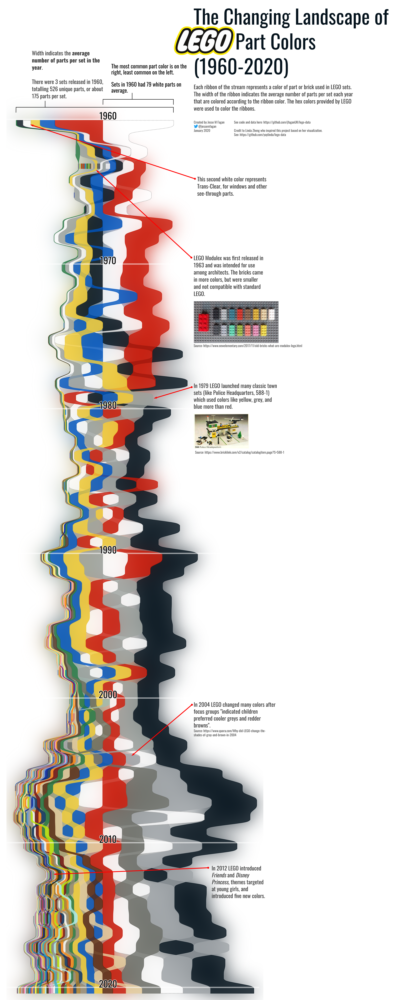

# LEGO Sorted Stream Graph

Inspired by a set of donut charts created by Linda Zheng. She did a great job cleaning and preparing the data. Cheers!

The labels, annotations, and post-processing are all done in Inkscape. It can be very difficult to do this in R.

# lego-data

